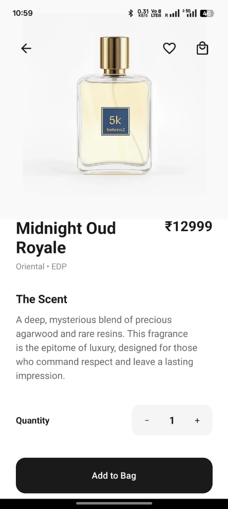
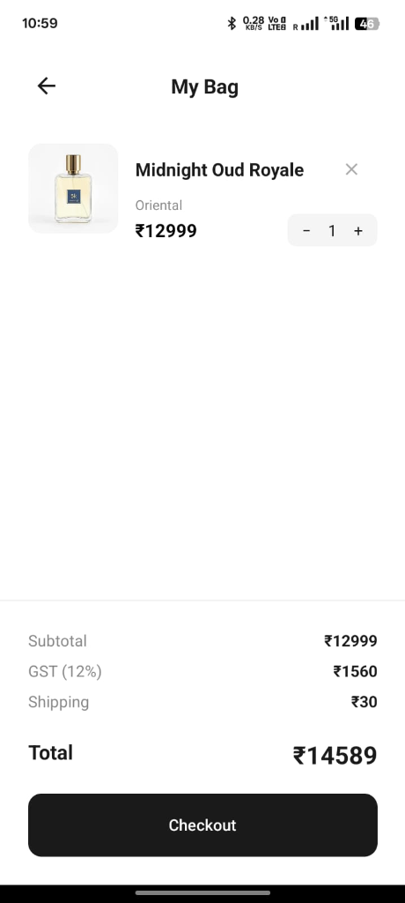

# Aroma Luxe - Premium Perfume Boutique

> This is Aroma Luxe, a mobile app I built for shopping luxury perfumes. The idea was to create a clean, simple, and premium-looking store where anyone can find their favorite fragrance easily.

---

## Project Showcase

<table>
  <tr>
<<<<<<< HEAD
    <td></td>
    <td></td>
    <td></td>
  </tr>
  <tr>
    <td></td>
    <td></td>
    <td></td>
=======
    <td></td>
    <td></td>
    <td></td>
  </tr>
  <tr>
    <td></td>
    <td></td>
    <td></td>
>>>>>>> b2d2626 (Final cle)
  </tr>
</table>

---

## Download the App

Scan the QR code below to download the app directly to your Android device:

<<<<<<< HEAD

=======

>>>>>>> b2d2626 (Final cle)

---

## Features

### Core Features
- **Luxury Catalog**: Browse a curated collection of high-end perfumes with a focus on visual aesthetics.
- **Scent Discovery (Quiz)**: An interactive AI-driven quiz that recommends the perfect fragrance based on user occasion and personality.
- **Detailed Product Pages**: Deep insights into every fragrance, including the olfactory pyramid (Top, Heart, and Base notes).
- **Order Details**: A deep-dive view into past orders, showing itemized breakdowns and delivery status.
- **Dynamic Shopping Cart**: Real-time cart management with integrated quantity adjustments.
- **Wishlist Management**: Save and track your favorite luxury scents for future purchases.
- **Secure Authentication**: User registration and login powered by JWT and BcryptJS.
- **Order Tracking**: Comprehensive history of all past luxury purchases and their current status.

### Premium Experience
- **Live Cart Badge**: Real-time updates of the cart count directly in the header.
- **Monochromatic Theme**: A premium, minimalist interface using a signature Black & White palette.
- **Offline Persistence**: Local data storage using AsyncStorage for a seamless experience even without immediate connectivity.
- **Responsive Layout**: Optimized for both mobile devices (iOS/Android) and web browsers.

---

## Tech Stack

### Frontend
- **Framework**: React Native with Expo
- **UI Architecture**: React Native Paper (Customized for Luxury UI)
- **Navigation**: React Navigation (Stack & Tab)
- **State Management**: React Context API
- **Local Storage**: AsyncStorage
- **Icons**: Material Community Icons

### Backend
- **Runtime**: Node.js
- **Framework**: Express.js
- **Security**: JSON Web Tokens (JWT), BcryptJS
- **Middleware**: CORS, Body-Parser, Dotenv
- **Database**: MongoDB Atlas (Cloud)

---

## How to Run

### Prerequisites
- Node.js (v18 or higher)
- npm or yarn
- Expo Go app (for mobile testing)

### Step 1: Clone the Repository
```bash
git clone <repository-url>
cd Perfume_APP
```

### Step 2: Backend Setup
```bash
cd backend
npm install
```
Start the backend server:
```bash
npm start
```

### Step 3: Frontend Setup
```bash
cd ../frontend
npm install
npx expo start
```

### Step 4: Run the App
- Press **w** for Web browser
- Press **i** for iOS simulator
- Press **a** for Android emulator
- Or scan the QR code with the **Expo Go** app

---

## Project Structure
```text
├── frontend/
│   ├── src/
│   │   ├── components/    # Reusable UI elements (Header, Cart Badge)
│   │   ├── screens/       # Detail view, Order Details, Scent Quiz, etc.
│   │   ├── context/       # Global state (Cart, Auth, Theme)
│   │   ├── theme/         # Centralized styling tokens
│   │   └── data/          # Product and olfactory metadata
│   └── App.js             # Application Entry
├── backend/
│   ├── routes/            # API endpoints
│   ├── controllers/       # Business logic
│   ├── middleware/        # Security and verification
│   └── server.js          # Express server entry
└── README.md              # Main documentation
```

---

## API Endpoints

### Authentication
- `POST /api/auth/register` : User registration
- `POST /api/auth/login` : User authentication

### User Management
- `GET /api/user/profile` : Fetch user data
- `PUT /api/user/update` : Update profile information

---

## Demo Checklist
- [ ] Welcome & Splash Screen navigation
- [ ] Product browsing and filtering
- [ ] Interactive Scent Quiz completion
- [ ] Adding/Removing items from Wishlist
- [ ] Cart management and real-time badge updates
- [ ] Secure checkout flow simulated
- [ ] Login/Register functionality
- [ ] Order history verification

---

## Author
**Devendra Mishra**

*Redefining perfume shopping through digital elegance.*

---
